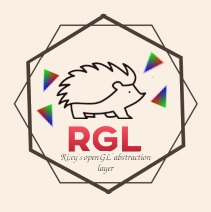

# RGL (Riley's OpenGL abstraction Layer)

Simple OpenGL version abstraction layer based on [RLGL](https://github.com/raysan5/raylib/blob/master/src/rlgl.h). 

- Allows you to use Modern OpenGL using the simple pipeline format.
- Allows you to switch between Modern OpenGL and Legacy OpenGL without changing the code.
- Allows you to load OpenGL 2.1, OpenGL 3.3, OpenGL ES, OpenGL ES2 or OpenGL 4.3
- Designed to be more lightweight and better performance than RLGL 
- Modular can easily be changed to support non-OpenGL backends

## Build statuses

# Documentation 
For documentation read the `RGL.h` file and check out the example in `./example`

Most OpenGL legacy documentation and examples should also apply to RGLx

# Implementing a new backend
To implement a new backend you'll have to.

* Init the backend in `rglInit` (loading shaders, other data)
* Implement a load/free texture system inside of `rglCreateTexture`, `rglUpdateTexture` and `rglDeleteTextures`
* Implement the backend's version of these functions, 
    * rglViewport
    * rglClearColor
    * rglClear
    * rglViewport
    * rglClearColor
    * rglDepthFunc
    * rglCullFace
    * rglFrontFace
    * rglHint
    * rglEnable
    * rglPushPixelValues
    * rglTextureSwizzleMask
    * rglAtlasAddBitmap
* Render the data supplied to `rglRenderBatchWithShader` via the backend
* Ensure all of the backend's allocated data is freed in `rglClose`

# Credits

# RLGL
This project was based on [RLGL](https://github.com/raysan5/raylib/blob/master/src/rlgl.h) and RLGL was used as a reference for some of the code in this project.